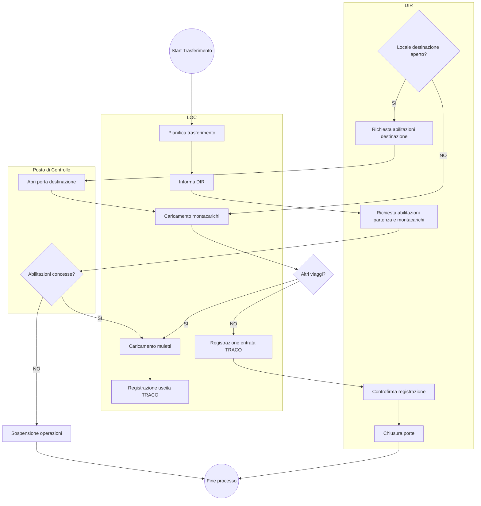

```mermaid

flowchart TD
%% SWIMLANE PER RUOLI OTTIMIZZATA

START((Start Trasferimento))

%% LOC
subgraph LOC [LOC]
    L1[Pianifica trasferimento]
    L2[Informa DIR]
    L3[Caricamento muletti]
    L4[Registrazione uscita TRACO]
    L5[Caricamento montacarichi]
    L6[Registrazione entrata TRACO]
end

%% DIR
subgraph DIR [DIR]
    D1[Richiesta abilitazioni partenza e montacarichi]
    D2{Locale destinazione aperto?}
    D3[Richiesta abilitazioni destinazione]
    D4[Controfirma registrazione]
    D5[Chiusura porte]
end

%% POSTO DI CONTROLLO
subgraph PC [Posto di Controllo]
    P1{Abilitazioni concesse?}
    P2[Apri porta destinazione]
end

%% FLUSSO LINEARE
START --> L1 --> L2 --> D1 --> P1
P1 -- NO --> STOP[Sospensione operazioni] --> END
P1 -- SI --> L3 --> L4

D2 -- SI --> D3 --> P2 --> L5

D2 -- NO --> L5

L5 --> G1{Altri viaggi?}
G1 -- SI --> L3
G1 -- NO --> L6 --> D4 --> D5 --> END

END((Fine processo))

```
