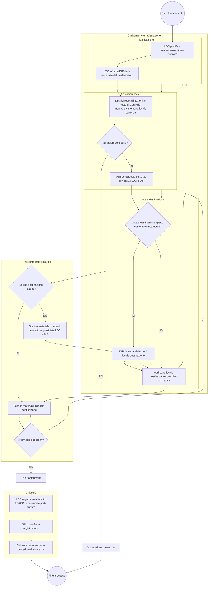

```mermaid

flowchart TD

START((Start trasferimento))

%% FASE 1 - Pianificazione
subgraph F1 [Pianificazione]
    A1[LOC pianifica trasferimento: tipo e quantità]
    A2[LOC informa DIR della necessità del trasferimento]
end
START --> A1 --> A2

%% FASE 2 - Abilitazioni partenza
subgraph F2 [Abilitazioni locali]
    B1[DIR richiede abilitazioni al Posto di Controllo: montacarichi e porta locale partenza]
    B2{Abilitazioni concesse?}
    C1[Apri porta locale partenza con chiavi LOC e DIR]
end
A2 --> B1 --> B2
B2 -- NO --> STOP1[Sospensione operazioni] --> END
B2 -- SI --> C1

%% FASE 3 - Abilitazioni locali destinazione (se possibile contemporaneo)
subgraph F3 [Locale destinazione]
    D1{Locale destinazione aperto contemporaneamente?}
    E1[DIR richiede abilitazioni locale destinazione]
    E2[Apri porta locale destinazione con chiavi LOC e DIR]
end
C1 --> D1
D1 -- SI --> E1 --> E2
D1 -- NO --> E2

%% FASE 4 - Caricamento materiale
subgraph F4 [Caricamento e registrazione]
    F1[Operai sotto coordinamento LOC caricano muletti]
    F2[Registrazione uscita TRACO in prossimità porta uscita]
    F3[Caricamento materiale nel montacarichi presidiato LOC]
end
E2 --> F1 --> F2 --> F3

%% FASE 5 - Trasferimento
subgraph F5 [Trasferimento e scarico]
    G1{Locale destinazione aperto?}
    G2[Scarico materiale in locale destinazione]
    G3[Scarico materiale in sala di lavorazione presidiata LOC + DIR]
    H1{Altri viaggi necessari?}
end
F3 --> G1
G1 -- SI --> G2 --> H1
G1 -- NO --> G3 --> E1 --> E2 --> G2 --> H1
H1 -- SI --> F1
H1 -- NO --> I1[Fine trasferimenti]

%% FASE 6 - Registrazione finale e chiusura
subgraph F6 [Chiusura]
    J1[LOC registra materiale in TRACO in prossimità porta entrata]
    J2[DIR controfirma registrazione]
    J3[Chiusura porte secondo procedure di sicurezza]
end
I1 --> J1 --> J2 --> J3 --> END

END((Fine processo))

```
